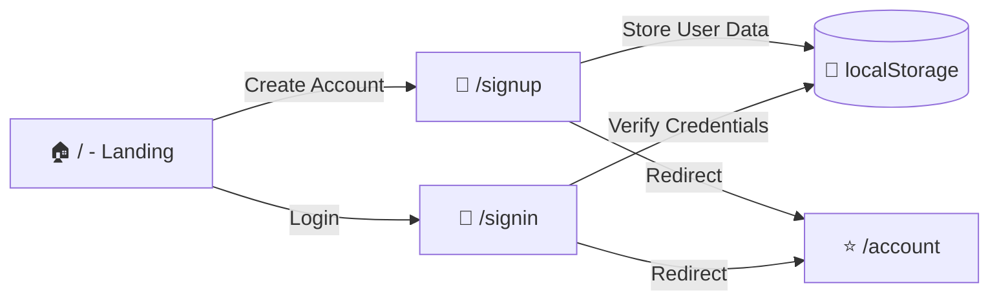

# Educase Assignment - React UI Clone 🚀

✨ A responsive React application implementing a UI design with React Router for navigation. Demonstrates component composition, form handling, and state management.

## 🎨 Design Provided

[Design](https://xd.adobe.com/view/b68eea25-003d-4a5d-8fdd-d463eeb20b32-e3dd)

## 🌐 User Flow



## 🏗️ Project Structure

```
educase-assignment/
├── public/               # 📁 Static assets
├── src/
│   ├── assets/           # 🖼️ Images & icons
│   ├── components/       # 🧩 Reusable components
│   │   ├── Buttons/      # 🔘 Button components
│   │   └── Inputs/       # ⌨️ Form inputs
│   ├── hooks/            # 🪝 Custom hooks
│   ├── pages/            # 🖥️ Route components
│   └── utils/            # ⚙️ Utility functions
├── vite.config.js        # ⚡ Vite config
└── eslint.config.js      # ✅ ESLint rules
```

## 🛠️ Technologies Used

<div align="left">
  
  
  
  
  
</div>

## ⚡ Installation

1. Clone the repository:

   ```bash
   git clone https://github.com/durubhuru14/educase-assignment.git
   cd educase-assignment
   ```

2. Install dependencies:

   ```bash
   npm install
   ```

3. Run the development server:

   ```bash
   npm run dev
   ```

   The app will open at `http://localhost:5173`

## 📜 Available Scripts

| Command           | Action                      |
| ----------------- | --------------------------- |
| `npm run dev`     | 🚀 Start development server |
| `npm run build`   | 📦 Create production build  |
| `npm run lint`    | 🔍 Run ESLint               |
| `npm run preview` | 👀 Preview production build |

## 🪝 Custom Hooks

- `useGlobalState`: 🌐 Manages shared application state

## 🐣 Author

**Durvesh More** (Online alias: **Durubhuru**)
🎓 Computer Science Undergrad (2027) | University of Mumbai

### 🌐 Connect With Me

📧 **Email**: [durveshmore.drm@gmail.com](mailto:durveshmore.drm@gmail.com)
🔗 **GitHub**: [Durubhuru14](https://github.com/Durubhuru14)
💼 **LinkedIn**: [Durvesh More](https://www.linkedin.com/in/durvesh-more-1016ab282)
